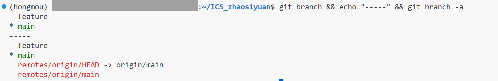
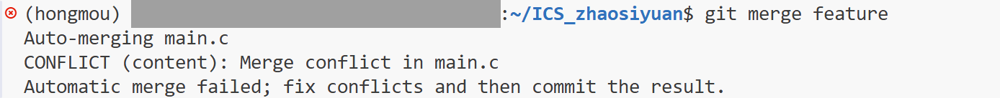
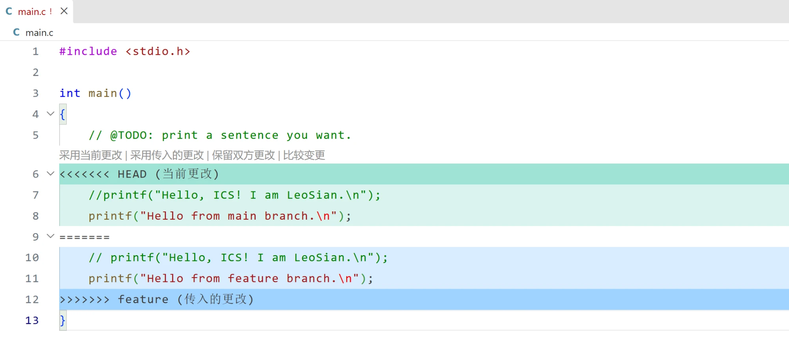
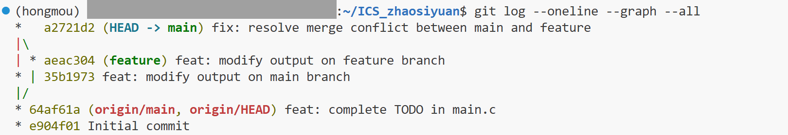

# Lab0: GitLab 实验报告


| GitHub 仓库 | https://github.com/LeoSian/ICS_zhaosiyuan |


---

## 一、文档问题回答

### 1.1 你之前有过多人协同开发的经历吗？如果有，你们是使用什么方式分工协作的？

有。
我参与了 AI 训练营的「论文检查 Agent」项目（仓库：https://github.com/TyrionXu-016/fudan-paper-check ），这是一个基于 Python 的论文格式自动预检工具，我们的分工协作方式主要有三点。

**一、任务分配写进仓库**：我们维护了一份 `handoff-matrix.md`，把功能拆成任务包按 Group 分给成员认领，状态变更也以 commit 记录，例如 `chore: LeoSian 认领 Agent 基础任务包`。

**二、按负责人或功能开分支**：仓库中除 `main` 外还有 `tyrion`、`feat/web-vue-frontend`、`codex/backend-api-sync` 等分支，较大改动先在分支上完成，不直接推 `main`。

**三、通过 Pull Request 合并并经 code review**：修改先PR，review通过后再merge主分支。


### 1.2 Git 为什么要设计"暂存-提交"两个步骤？

Git 把一次修改的落地拆成 `git add` 和 `git commit`，中间隔了一个**暂存区**（staging area，也叫 index，实际存储在 `.git/index`）。因此本地文件存在三个区域：

```
工作区              暂存区              本地仓库
(working dir) --add--> (index) --commit--> (repository)
```

之所以不合并成一步，主要有四个理由。

**1. 让每个 commit 保持语义单一。** 实际写代码时，一次往往会同时改好几处代码。如果 `add` 和 `commit` 合并成一步，这些改动只能一起提交，生成一个混杂的 commit。日后若发现一个部分有问题想回退，就会连带把其他改动也退掉。

有了暂存区，就可以先 `git add` 属于 bug 修复的文件、提交一次，再 `git add` 其余文件、提交第二次。提交历史的粒度由开发者决定，而不是被"保存时机"绑死。这也是 `git revert`、`git cherry-pick`、`git bisect` 这些命令能够有效工作的前提——它们都假设每个 commit 是一个自洽的最小单元。

**2. 提供提交前的检查窗口。** 三个区域的划分让 diff 有了两个层次：

- `git diff` —— 工作区与暂存区的差异，即**还没被 `add` 的改动**
- `git diff --staged` —— 暂存区与上次提交的差异，即**本次提交将要包含的内容**

`git commit` 之前跑一遍 `git diff --staged`，是确认"我到底要提交什么"的最后机会。一步到位的设计里没有这个检查点。

**3. 允许分批构建一次提交。** 一个功能可能要改动多个文件，开发过程中随写随 `add`，最后统一 `commit`。

**4. 粒度可以细到行。** `git add -p` 会把文件的改动切成若干 hunk 逐个询问是否暂存。这意味着同一个文件里的不同改动也能拆进不同的提交。


### 1.3 `git branch` 和 `git branch -a` 的区别是什么？

区别在于**列出的分支范围**：

| 命令 | 列出的内容 |
|---|---|
| `git branch` | 仅**本地分支** |
| `git branch -r` | 仅**远程跟踪分支**（remote-tracking branches） |
| `git branch -a` | 本地分支 **+** 远程跟踪分支 |

在本次实验的仓库中（完成任务四、建好 `feature` 分支之后）实测：

```
$ git branch
  feature
* main

$ git branch -a
  feature
* main
  remotes/origin/HEAD -> origin/main
  remotes/origin/main
```



`git branch -a` 多出的 `remotes/origin/*` 是远程跟踪分支，即本地记录的“远程仓库上次同步时的状态”；而 `feature` 只存在于本地、没有推送，所以不会出现在 `remotes/` 下面。

---

## 二、完成 main.c

### 2.1 环境

| 项 | 版本 |
|---|---|
| 系统 | Windows 11 + WSL 2 / Ubuntu 22.04.5 LTS |
| 架构 | x86_64 |
| Git | 2.34.1 |
| GCC | 14.3.0 |
| Make | 4.3 |

### 2.2 修改内容

模板中 `main.c` 的原始内容为：

```c
#include <stdio.h>

int main()
{
    // @TODO: print a sentence you want.
    printf("Hello, world!\n");
}
```

修改后：

```c
#include <stdio.h>

int main()
{
    // @TODO: print a sentence you want.
    printf("Hello, ICS! I am LeoSian.\n");
}
```

### 2.3 编译与运行

```bash
make
./main
make clean
```

运行结果：

```
$ make
gcc -Wall -O2 -c main.c -o main.o
gcc -Wall -O2 -o main main.o
$ ./main
Hello, ICS! I am LeoSian.
```

程序能正常编译，且输出不再是 `Hello, world!`，满足自动评分的判定条件。

### 2.4 提交

```bash
git add main.c
git commit -m "feat: complete TODO in main.c"
git push
```

推送后 GitHub Actions 自动运行评分，提交 `64af61a` 的结果为 **Points 100/100**。

---

## 三、阅读与思考

### 3.1 《Commit message 和 Change log 编写指南》（阮一峰）

**内容概括：**

这篇文章介绍了 Angular 团队的 commit message 规范及其衍生的工具链。一条规范的提交信息分为 Header、Body、Footer 三部分，其中 Header 必需且只占一行，格式为 `type(scope): subject`。`type` 说明本次提交的类别，取值包括 `feat`（新功能）、`fix`（修补 bug）、`docs`（文档）、`style`（不影响逻辑的格式调整）、`refactor`（重构）、`test`（测试）、`chore`（构建过程或辅助工具的变动）；`scope` 标明影响范围；`subject` 是简短描述。Body 补充详细说明，Footer 用于记录不兼容变动和关闭的 issue。

作者指出，这样做的价值不止于"好看"：结构化的提交信息让开发者能够按类型过滤历史记录、快速浏览变更，更重要的是可以由工具直接从提交记录**自动生成 Change log**。文章还介绍了三个配套工具——Commitizen 用于交互式撰写、validate-commit-msg 用于格式校验、conventional-changelog 用于生成更新日志。

**结合自身经历：**

我在「论文检查 Agent」项目中写的提交大多符合这套规范，例如 `feat: implement backend agent pipeline MVP`、`test: add agent pipeline unit tests`、`docs: update handoff matrix with completed tasks`，队友还用上了 scope，如 `feat(web-vue): ...`。但回头看，规范并没有被统一执行：同一个仓库里也有 `Update 01_项目说明文档.md`、`Reduce paper check noise` 这类不带 type 的提交，我自己也写过一条 `checkout: temporary commit for worktree checkout`，而 `checkout` 并不是规范中的 type。读完文章才意识到，只要有一部分提交不守规范，就无法可靠地用工具自动生成 Change log，这正是 validate-commit-msg 这类校验工具存在的意义。

### 3.2 《Gitflow 使用规范》

**内容概括：**

这篇文章讲解了 Gitflow 分支管理模型，核心思想是让不同分支各司其职，避免多人协作时版本混乱。

它把分支分为两类。**主分支**有两个：`master` 保存线上生产代码，只接受来自 release 或 hotfix 的合并，并在其上打版本 tag；`develop` 基于 master 创建，是团队开发的公共分支。**辅助分支**则对应开发流程的各个阶段：开发新功能时，成员从 develop 切出 `feature` 分支，自测完成后合回 develop；迭代进入提测阶段，从 develop 推出 `release` 分支部署到测试环境；测试中发现的缺陷从 release 切出 `bugfix` 分支修复，合回后即删除，保证一个 bugfix 分支只做一件事；测试通过后 release 合并进 master 上线；若线上出现故障，则从 master 切出 `hotfix` 分支紧急修复，再按同样流程合回。

文章把这套规则概括成一句话——**"从哪里来，最后回到哪里去。"** 此外还提到版本号采用三段式（重大事件.功能迭代.热修复），tag 只用数字和点号，分支命名官方推荐用 `-` 连接。

**结合自身经历：**

对照 Gitflow，我们的项目只用到了其中一部分：有 `feat/web-vue-frontend` 这样的功能分支，也通过 PR 合并，但没有 `develop` 分支，功能分支直接合进 `main`；没有 release 和 hotfix 分支，整个仓库也没有打过任何版本 tag。分支命名同样不统一，`tyrion`、`mse-tyrion` 按人名，`feat/web-vue-frontend` 按功能。对一个周期短、人数少的训练营项目来说，省掉 develop 和 release 是合理的简化；但如果项目需要长期维护、正式发版，Gitflow 的分层就很有必要。

### 3.3 为什么要学习 Git

对个人来说，Git 让每一次修改都可以回退，不再需要 `main_old.c`、`main_final_v2.c` 这样的手动备份。对协作来说，我在训练营项目里提交的 PR 能被队友逐行 review、指出问题后再合并，这种协作方式离开版本控制无法实现。对工程来说，提交规范、Change log、语义化版本这些实践都建立在一份结构化的提交历史之上，Git 是它们的共同基础。此外，本课程后续的实验也都通过 Git 提交、由 push 触发自动评分，掌握 Git 是完成课程的前提。

---

## 四、分支管理与冲突解决

### 4.1 创建 feature 分支并提交

```bash
git switch -c feature
# 修改 main.c 的第 6 行
git add main.c
git commit -m "feat: modify output on feature branch"
```

feature 分支上，把原来的输出语句注释掉，并新增一行：

```c
    // printf("Hello, ICS! I am LeoSian.\n");
    printf("Hello from feature branch.\n");
```

### 4.2 切回 main 分支并提交

```bash
git switch main
# 修改 main.c 的同一行，内容与 feature 分支不同
git add main.c
git commit -m "feat: modify output on main branch"
```

main 分支上做了同样的事，但新增的内容不同：

```c
    //printf("Hello, ICS! I am LeoSian.\n");
    printf("Hello from main branch.\n");
```

> 💡 **为什么这样改会冲突**：Git 以行为单位做三方合并。两个分支都以同一个 commit 为起点，又各自修改了**同一个文件的同一行**且内容不同，Git 无法判断该保留哪一个，只能交给人工处理。
### 4.3 执行合并，触发冲突

```bash
git merge feature
```

输出：

```
Auto-merging main.c
CONFLICT (content): Merge conflict in main.c
Automatic merge failed; fix conflicts and then commit the result.
```

此时 `main.c` 中出现冲突标记：

```c
#include <stdio.h>

int main()
{
    // @TODO: print a sentence you want.
<<<<<<< HEAD
    //printf("Hello, ICS! I am LeoSian.\n");
    printf("Hello from main branch.\n");
=======
    // printf("Hello, ICS! I am LeoSian.\n");
    printf("Hello from feature branch.\n");
>>>>>>> feature
}
```

其中 `<<<<<<< HEAD` 到 `=======` 之间是当前分支（main）的内容，`=======` 到 `>>>>>>> feature` 之间是被合并分支（feature）的内容。

终端中的冲突提示：



VS Code 中的冲突标记：



### 4.4 解决冲突并提交

保留 main 分支（HEAD）一侧的内容，删掉 feature 一侧的内容以及 `<<<<<<<`、`=======`、`>>>>>>>` 三个标记，得到：

```c
#include <stdio.h>

int main()
{
    // @TODO: print a sentence you want.
    //printf("Hello, ICS! I am LeoSian.\n");
    printf("Hello from main branch.\n");
}
```

```bash
git add main.c
git commit -m "fix: resolve merge conflict between main and feature"
```

解决后重新编译运行，输出为 `Hello from main branch.`，程序正常，且仍满足自动评分的要求。

合并后的提交树：

```bash
git log --oneline --graph --all
```

```
*   a2721d2 (HEAD -> main) fix: resolve merge conflict between main and feature
|\
| * aeac304 (feature) feat: modify output on feature branch
* | 35b1973 feat: modify output on main branch
|/
* 64af61a (origin/main, origin/HEAD) feat: complete TODO in main.c
* e904f01 Initial commit
```



可以看到，`feature` 与 `main` 从 `64af61a` 分叉，各自提交一次，最后由合并提交 `a2721d2` 汇合。

---

## 五、实验步骤汇总

1. **环境准备**：在 Windows 11 上使用 WSL 2（Ubuntu 22.04），配置 `git config --global user.name` 与 `user.email`，将 SSH 公钥添加到 GitHub，并用 `ssh -T git@github.com` 验证连接。
2. **创建仓库**：在模板仓库页面点击 Use this template → Create a new repository，创建个人仓库 `LeoSian/ICS_zhaosiyuan`。
3. **克隆到本地**：`git clone git@github.com:LeoSian/ICS_zhaosiyuan.git`
4. **完成 TODO**：修改 `main.c` 的输出语句，`make && ./main` 验证后执行 `git add main.c`、`git commit`、`git push`，自动评分 100/100。
5. **feature 分支提交**：`git switch -c feature`，修改 `main.c` 后提交。
6. **main 分支提交**：`git switch main`，修改 `main.c` 的同一处后提交。
7. **合并与解决冲突**：`git merge feature` 产生冲突，手动处理后 `git add main.c`、`git commit` 完成合并。
8. **提交报告**：编写 `report.md`，与截图一起 `git add`、`git commit`，最后 `git push` 推送到 GitHub。

---

## 六、建议

1. 模板仓库缺少 `.gitignore`。执行 `make` 会生成 `main` 和 `main.o`，而实验文档建议用 `git add .` 提交，很容易把编译产物一起提交进仓库，建议在模板中加入 `.gitignore`，忽略 `main` 和 `*.o`。

